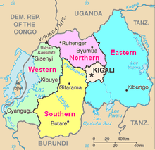

```{r echo=TRUE, message=FALSE, warning=FALSE}
rm(list = ls())

#load package
library(tidyverse)
library(tidyr)
library(broom)
library(purrr)


#setworking directory and load the data
setwd("C:/stata assignments/complete/interview questions/laterite data/Solutions to assignment 2")

data <- read_csv("laterite_education_data.csv", col_names = T,cols(
  X1 = col_double(),
  province = col_factor(),
  district = col_factor(),
  ur2012 = col_factor(),
  weight = col_double(),
  Consumption = col_double(),
  s1q1 = col_factor(),
  s1q3y = col_double(),
  s1q13 = col_factor(),
  s1q14 = col_factor(),
  s3q4 = col_factor(),
  s4aq6a = col_character(),
  s4aq6b = col_character(),
  s4aq8 = col_factor(),
  s4aq9 = col_factor(),
  s4aq11h = col_double(),
  s4aq12 = col_factor(),
  s4aq14 = col_double(),
  s4aq15 = col_factor(),
  s4aq17 = col_factor(),
  s4bq3 = col_factor(),
  s4bq4 = col_factor(),
  s4bq5 = col_factor(),
  s6aq2 = col_factor()
))

## rename the variables
names(data)
r_data <- data %>% rename(Sex = s1q1, 
                          Age=s1q3y, 
                          region_class = ur2012,
                          Father_alive=s1q13,
                          Mother_alive = s1q14, 
                          health_prob=s3q4,
                          Grade_2012=s4aq6a ,
                          Grade_2013=s4aq6b , 
                          sch_attended_prev_yr=s4aq8  , 
                          prob_in_sch=s4aq9,
                          edu_expenses=s4aq11h,
                          paid_edu_expenses_year_end=s4aq12 , 
                          sch_days_missed=s4aq14  , 
                          why_not_attending_sch=s4aq15 ,
                          why_leave_sch=s4aq17 ,
                          can_read=s4bq3 ,
                          can_write=s4bq4,
                          can_calculate=s4bq5 ,
                          farm_work=s6aq2  )


## Define the missing values as NAs then remove them from the two variables.

r_data <- r_data %>% na_if("") %>% filter(!is.na(Grade_2012),!is.na(Grade_2013))

#create dummy variables,i.e grade repeat and dropout outcome

r_data$repeated <- factor(r_data$Grade_2012==r_data$Grade_2013)
r_data$dropout <- factor(!(r_data$Grade_2012%in%c("Not in class"))&r_data$Grade_2013%in%c("Not in class"))


## how grade repetition varies by grade in Primary Education 
comparis <- r_data %>% filter(!(Grade_2012%in%c("Not in class")))
table(r_data$Grade_2012,r_data$repeated)->comparison_repetition_in_classes_2012
```

## Abstract

This document is presents the report from analysis conducted on Primary Education for the Ministry of Education (MINEDUC) in Rwanda. This report mainly focuses on rural and urban areas in Rwanda.

## Introduction

This report investigates the causes of repetiton in primary education. Rural area here mean that the setting of the school location has low standards of living status and low population to infrastructure ratio while urban is the opposite.

## Descriptive analysis

### Provinces 

The report was mainly done in Rwanda where 5 provinces were considered. The provinces were Kigali city, Southern province, Western province, Northern Province and Eastern province. The table below summarises the percentage distribution of students from each province. Kigali city had 22.15 percent which was the highest numbers from a province in this study. However, the rest of the provinces had a nearly similar number with Southern province having the lowest number of students at 17.1 percent.

```{r echo=TRUE, message=FALSE, warning=FALSE}
table(r_data$province)->tabb
prop.table(tabb)*100->tabb1
tabb1%>% knitr::kable()
```


Source: [Wikipedia, 2019](https://www.google.com/search?q=rwanda+provinces&source=lnms&tbm=isch&sa=X&ved=0ahUKEwjmlbz2n4TkAhUH4YUKHeofC2gQ_AUIESgB&biw=1267&bih=552#imgrc=kKTwdESvEuc3mM:)

### Districts

The report also looked at the following districts in Rwanda which are; Nyarugenge,Gasabo,Kicukiro,Nyanza,Gisagara,Nyaruguru,HuyeNyamagabe,Ruhango,Muhanga,Kamonyi,Karongi,RutsiroRubavu,Nyabihu,Ngororero,Rusizi,Nyamasheke,Rulindo,Gakenke,Musanze,Burera,Gicumbi,Rwamagana,Nyagatare,Gatsibo,Kayonza,Kirehe,Ngoma,Bugesera. The table below summarises the percentage distribution of students from each district. For this study, Gesabu had the highest number of student, 357 and Huye had the lowest number, which is 31 students.

```{r echo=TRUE, message=FALSE, warning=FALSE}
table(r_data$district)->tab2
tab2%>% knitr::kable()
```

### Spread by region

The study divided region into four regions depending on the economic and development status. The regions considered in this study include;- Urban, rural, semi-urban and peri-urban regions. The table below show that the highest number was from the rural region having 75,5 percent of the number of students in this study. This shows that the researcher chose higher samples from the population from the rural set-up which might be suspected to have high turn over of repeating in grades.

```{r echo=TRUE}
table(r_data$region_class) -> tadw
prop.table(tadw)*100-> tabww
tabww %>% knitr::kable()
```


### Gender Distribution

The study tried to sample an equal number of students in respect to gender. This is shown by the table below where the ratio of famales to men was almost one to one. 

```{r echo=TRUE, message=FALSE, warning=FALSE}
table(r_data$Sex) -> tadyy
prop.table(tadyy)*100-> tabyy
tabyy %>% knitr::kable()
```

## Analysis

###  Repetition within grades in Primary Education

This analysis shows the findings of how repetition in grades in primary school varies across grades in school. It can be seen that at the time of study, apart from primary 1 having the highest number of students, 39.5 percent of the 686 pupils in that class had actually repeated the same grade from 2012. The other classes with the highest repetition rate are primary 2 (23.6 percent of 470), primary 5 (22.3 percent of 260), primary 3 (16.8 percent of 392) and primary 4 (16.7 percent of 305). It is also worthy noting that from post primary 1 to post primary 5 there was no cases of repetiton from 2012.

```{r echo=TRUE, message=FALSE, warning=FALSE}
## how grade repetition varies by grade in Primary Education 
comparis <- r_data %>% filter(!(Grade_2012%in%c("Not in class")))
table(comparis$Grade_2012,comparis$repeated)->comparison_repetition_in_classes_2012
prop.table(comparison_repetition_in_classes_2012,1)*100->tabwew
tabwew %>% knitr::kable()

ggplot(comparis, aes(x=repeated))+ geom_bar(position = "dodge")+facet_wrap(~Grade_2012)
ggplot(comparis, aes(x=Grade_2012,fill =repeated))+ geom_bar(position = "stack")+coord_flip()
```

### Males equally likely to drop out as females.

The research also wanted to check which gender had a higher drop out rate. The results showed a comparisons which was not significate  between the two genders (since t.test  for which variance is same showes a p-value of 0.9765 using Welch two sample test, which is > 0.05). This shows that the two means of the genders were almost equal and therefore the conclusion would be that both male and female pupils had equal chances of dropping out from school.
```{r echo=TRUE, message=FALSE, warning=FALSE}
## dropout by gender
var.test(dropout_gender[2,],dropout_gender[1,])
t.test(dropout_gender[1,],dropout_gender[2,], var.equal = T)
```

### Regression analysis

In with the aim of investigating the determinants contributing to increase in rate of repetition, the researcher opted to consider the following predictor variables;-  the weight, age, whether the father or mother was alive or not, the health problems suffered in the last 4 weeks, grade attended in during 2012 and 2013, who paid for the student expenses for the last 12 months and the reason why they(pupils who missed) didnt attend school. The response variable would be repeating a grade in school which would be binary,where 1 would mean repeated is true and 0 if otherwise. A binary logistic regression model was used. The predictor with p-value that were less than 0.05 were reported as significant.

```{r echo=TRUE, message=FALSE, warning=FALSE}
## variables contributing to repeat in primary
##our response variable would be repeating which is binary, so we recode into 1 if repeated is true and 0 if otherwise.
r_dara <- r_data %>% mutate(repeated = ifelse(repeated %in% c('TRUE'), 1L, 0L))


## we use a binary logistic model to get p-values

coefficients_of_vars_plus_pvalues <- r_dara %>%  group_by(region_class) %>% nest(-region_class) %>% mutate(models = map(data, ~lm(repeated~weight+Consumption+Sex+Age+Father_alive+Mother_alive+health_prob+sch_attended_prev_yr+prob_in_sch+Grade_2013+Grade_2012+paid_edu_expenses_year_end+why_not_attending_sch, .))) %>% mutate(tidied = map(models, tidy)) %>% unnest(tidied) %>% filter(region_class %in%c("Rural","Urban")) %>% select(-statistic) %>% mutate(p.adjusted = p.adjust(p.value)) 


#export the table
#write.csv(coefficients_of_vars_plus_pvalues,"all_p.values.csv",row.names = F)

## Get the significant variables i.e that have p-value < 0.5
coefficients_of_vars <- r_dara %>%  group_by(region_class) %>% nest(-region_class) %>% mutate(models = map(data, ~lm(repeated~weight+Consumption+Sex+Age+Father_alive+Mother_alive+health_prob+sch_attended_prev_yr+prob_in_sch+Grade_2013+Grade_2012+paid_edu_expenses_year_end+why_not_attending_sch, .))) %>% mutate(tidied = map(models, tidy)) %>% unnest(tidied) %>% filter(region_class %in%c("Rural","Urban")) %>% select(-statistic) %>% mutate(p.adjusted = p.adjust(p.value)) %>% filter(p.adjusted < .05)

#export the table
#write.csv(coefficients_of_vars,"significant_p.values at 0.5.csv",row.names=F)


# Sort for the variables the highest causes of repetition in class
causes <- coefficients_of_vars %>%  filter(region_class=="Rural",term != "(Intercept)") %>% arrange(desc(estimate))
causes %>% knitr::kable()

#write.csv(causes,"arranged causes of repetition in rural schools.csv", row.names = F)
```

The table above show the findings of analysis from the rural area in rwanda where only problems experienced in school, grade in 2012 and 2013 were significant, we took . It shows that in 2012, pupils in primary 5,(6 to 8),4,3,2 and 1 were 13.73, 10.91, 9.12, 6.11, 3.74, 2.09 times more likely to repeat the same grade, in that order, than the students in post primary 1. Other hand, in 2013, pupils in pre-primary were 27 percent less likely to repeat the same grade as compared to those in post primary 1 in 2013. Further, those in primary 6, 7, 8 in 2013, were the least likely to repeat, i.e, 96.7 percent less likely to repeat as compared to post primary 1 in 2013.

```{r echo=TRUE, message=FALSE, warning=FALSE}
# Sort for the variables the highest causes of repetition in class
causes2 <- coefficients_of_vars %>%  filter(region_class=="Urban",term != "(Intercept)") %>% arrange(desc(estimate))
causes2 %>% knitr::kable()

#write.csv(causes2,"arranged causes of repetition in urban schools.csv", row.names = F)
```

The table above as shows a snap short of the analysis of urban areas in Rwanda. As compared to the rural areas, the urban pupil were less likely to repeat, as shown in the table.

### Strengths and weakness of the data

#### The advantages of this data is that;-

1. The variables were specific since it was mainly focused in the rural areas.

2. The data was reliable because it did not have many outliers in the variables.

3. The data was observational and designed to control for gender as a cofounding variable

#### The disadvantages of this data was that;-

1. It had alot of missing values

2. The variables were highly correlated as shown from some of the test that has been conducted.

3. The data was collected not clean and needed some transformation.

4. some of the variable were not suitable to answer the main object of students repeating or passing. 


